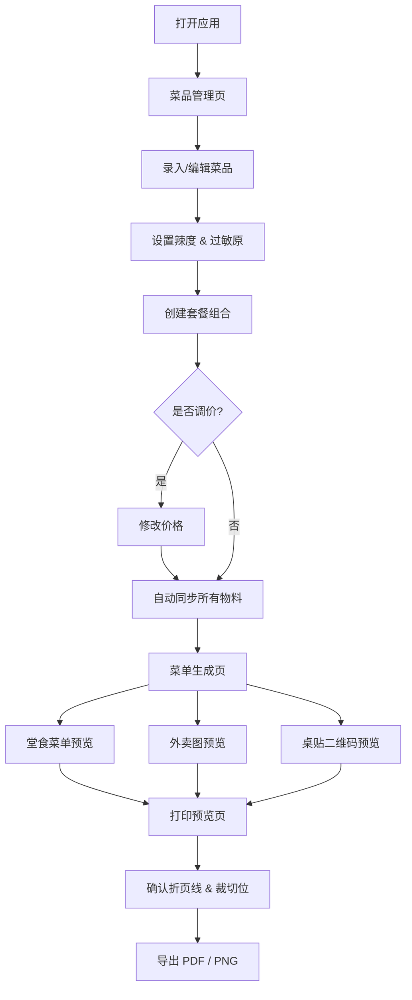

## 1. 产品概述

餐饮菜单设计器是一款面向餐厅店主的可视化菜单编辑工具。店主在统一界面中录入菜品名称、价格、辣度、过敏原和套餐信息后，系统自动生成三种物料：堂食折页菜单、外卖平台展示图和桌贴二维码卡片。所有物料共享同一菜品数据源，价格调整后全部版本实时同步更新，打印预览清晰标注折页线和裁切标记。

- 目标用户：中小型餐厅、咖啡馆、奶茶店等店主（非设计师群体）
- 核心价值：一次录入、多端输出、实时同步、所见即所得的打印预览

## 2. 核心功能

### 2.1 用户角色

| 角色 | 使用方式 | 核心权限 |
|------|----------|----------|
| 店主 | 直接访问 | 编辑菜品、生成菜单、打印预览、导出图片 |

### 2.2 功能模块

1. **菜品管理页**：菜品列表、添加/编辑/删除菜品、辣度标记、过敏原标签、套餐组合
2. **菜单生成页**：堂食菜单预览、外卖图预览、桌贴二维码预览、价格同步机制
3. **打印预览页**：折页线标注、裁切位标记、多尺寸模板选择、导出 PDF / PNG

### 2.3 页面详情

| 页面名称 | 模块名称 | 功能描述 |
|----------|----------|----------|
| 菜品管理页 | 菜品列表 | 以卡片表格展示所有菜品，支持按分类筛选、搜索 |
| 菜品管理页 | 菜品编辑表单 | 弹窗式编辑：名称、价格、分类、辣度（0-5级辣椒图标）、过敏原多选标签、图片上传 |
| 菜品管理页 | 套餐管理 | 创建套餐组合，设定套餐价，关联单品并自动计算节省金额 |
| 菜品管理页 | 价格批量调整 | 支持按百分比或固定金额批量调价，调整后所有菜单版本自动刷新 |
| 菜品管理页 | 菜品分类管理 | 新增/编辑/删除分类（如：凉菜、热菜、主食、饮品），拖拽排序 |
| 菜单生成页 | 堂食菜单预览 | 三折页排版预览，按分类分栏展示菜品及价格，含辣度和过敏原图标 |
| 菜单生成页 | 外卖图预览 | 竖版 750×1334 适配外卖平台，突出主图和价格，醒目辣度/过敏标签 |
| 菜单生成页 | 桌贴二维码预览 | 小卡片布局，含二维码（链接至在线菜单）、店名、WiFi 密码预留位 |
| 菜单生成页 | 实时同步指示器 | 显示各物料的"数据已同步"状态徽标，价格变更后闪烁提示更新 |
| 打印预览页 | 折页线标注 | 在堂食菜单上用虚线标出三折页的两条折叠线位置 |
| 打印预览页 | 裁切位标记 | 四角和边缘显示裁切角标（出血区域），含安全区边框 |
| 打印预览页 | 模板尺寸选择 | A4 三折页、A5 双面、自定义尺寸，切换后实时刷新预览 |
| 打印预览页 | 导出功能 | 一键导出 PDF（含折页/裁切标记）或各版本 PNG 图片 |

## 3. 核心流程

店主打开应用 → 在菜品管理页录入/编辑菜品信息（名称、价格、辣度、过敏原） → 创建套餐组合 → 切换到菜单生成页查看三种物料的实时预览 → 如需调价返回菜品管理页修改 → 系统自动同步更新所有物料 → 进入打印预览页确认折页线和裁切位 → 导出 PDF 或 PNG

## 4. 用户界面设计

### 4.1 设计风格

- **主色调**：深炭黑 (#1A1A1A) + 暖橘红 (#E85D3A) 强调色，搭配米白 (#FAF6F1) 背景
- **辅助色**：辣度使用从绿到红的渐变色阶，过敏原使用琥珀色警示标签
- **按钮风格**：圆角 8px，主按钮为橘红实色，次按钮为描边样式，hover 时微抬阴影
- **字体**：标题使用 Noto Serif SC 衬线字体营造餐饮质感，正文使用 Noto Sans SC 无衬线体保证可读性
- **布局风格**：左侧固定导航栏 + 右侧内容区，菜品管理用网格卡片，菜单预览用居中仿真纸张
- **图标风格**：线性图标（Lucide 风格），辣椒辣度用填充式渐进图标

### 4.2 页面设计概览

| 页面名称 | 模块名称 | UI 元素 |
|----------|----------|----------|
| 菜品管理页 | 菜品列表 | 网格卡片布局，每张卡片含菜品图、名称、价格、辣度辣椒、过敏原标签，右上角编辑/删除图标 |
| 菜品管理页 | 菜品编辑表单 | 侧滑抽屉面板，辣度用 5 颗辣椒点击选择，过敏原用可多选的胶囊标签组 |
| 菜品管理页 | 套餐管理 | 卡片内嵌套组合展示，虚线连接关联菜品，节省金额用绿色突出 |
| 菜品管理页 | 价格批量调整 | 顶部工具栏下拉面板，含百分比/固定值切换和预览变更列表 |
| 菜单生成页 | 堂食菜单预览 | 仿真 A4 纸张居中展示，三折页带折叠虚线，分类标题用装饰分隔线 |
| 菜单生成页 | 外卖图预览 | 竖版手机框架模拟，主图区域 + 价格大字 + 标签行 |
| 菜单生成页 | 桌贴二维码预览 | 小尺寸卡片，居中二维码 + 店名 + 装饰边框 |
| 菜单生成页 | 同步状态指示器 | 三个小圆点徽标，绿色=已同步，橙色=更新中，附文字说明 |
| 打印预览页 | 折页/裁切叠加层 | 虚线折页线 + 角标裁切位 + 安全区淡色边框，可开关叠加层 |
| 打印预览页 | 导出工具栏 | 底部固定工具栏，含模板尺寸下拉、导出 PDF 按钮、导出 PNG 按钮 |

### 4.3 响应式设计

- 桌面优先设计，主要在 PC 端使用（店主办公场景）
- 平板端：导航栏收缩为底部 Tab，卡片改为单列
- 移动端：仅保留菜品管理的基础编辑功能，菜单预览和打印预览提示"请在电脑端使用"

### 4.4 3D 场景指导

不适用
