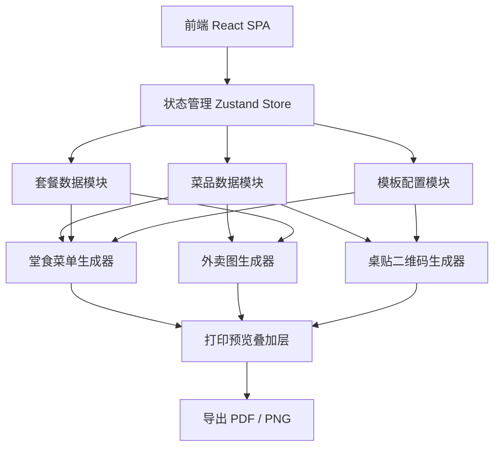
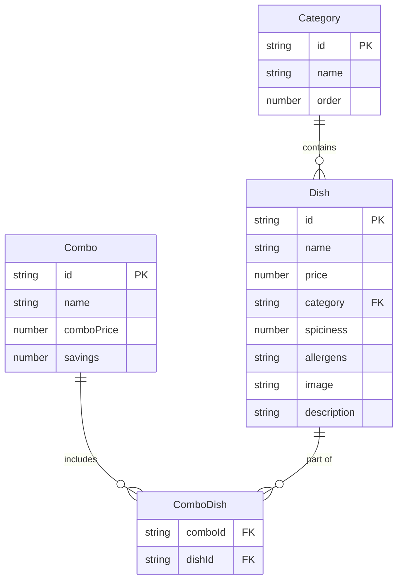

## 1. 架构设计



## 2. 技术说明

- **前端**：React@18 + Tailwind CSS@3 + Vite
- **初始化工具**：Vite (react-ts 模板)
- **状态管理**：Zustand — 轻量级响应式 Store，菜品/套餐/模板数据全局共享，价格变更自动触发所有订阅组件重渲染
- **二维码生成**：qrcode.react — 在桌贴卡片中生成在线菜单链接二维码
- **PDF 导出**：html2canvas + jsPDF — 将 DOM 预览截图转为 PDF
- **图片导出**：html2canvas — 将各版本预览转为 PNG
- **后端**：无（纯前端应用，数据存储在 localStorage）
- **数据库**：无（localStorage 持久化，支持导入/导出 JSON 备份）

## 3. 路由定义

| 路由 | 用途 |
|------|------|
| / | 重定向到 /menu-editor |
| /menu-editor | 菜品管理页：菜品列表、编辑表单、套餐管理、价格调整 |
| /menu-preview | 菜单生成页：堂食/外卖/桌贴三种预览 + 实时同步 |
| /print-preview | 打印预览页：折页线、裁切位、模板尺寸、导出 |

## 4. API 定义

无后端 API。所有数据通过 Zustand Store 管理，持久化到 localStorage。

核心数据结构：

```typescript
interface Dish {
  id: string
  name: string
  price: number
  category: string
  spiciness: 0 | 1 | 2 | 3 | 4 | 5
  allergens: Allergen[]
  image?: string
  description?: string
}

type Allergen = 'peanut' | 'dairy' | 'gluten' | 'seafood' | 'egg' | 'soy' | 'nuts' | 'sesame'

interface Combo {
  id: string
  name: string
  dishIds: string[]
  comboPrice: number
  savings: number
}

interface Category {
  id: string
  name: string
  order: number
}

interface TemplateConfig {
  size: 'A4-trifold' | 'A5-dual' | 'custom'
  customWidth?: number
  customHeight?: number
  showFoldLines: boolean
  showCropMarks: boolean
  showSafeZone: boolean
}

interface MenuStore {
  dishes: Dish[]
  combos: Combo[]
  categories: Category[]
  templateConfig: TemplateConfig
  addDish: (dish: Omit<Dish, 'id'>) => void
  updateDish: (id: string, updates: Partial<Dish>) => void
  deleteDish: (id: string) => void
  batchPriceAdjust: (ids: string[], mode: 'percent' | 'fixed', value: number) => void
  addCombo: (combo: Omit<Combo, 'id' | 'savings'>) => void
  updateCombo: (id: string, updates: Partial<Combo>) => void
  deleteCombo: (id: string) => void
  updateTemplateConfig: (config: Partial<TemplateConfig>) => void
}
```

## 5. 服务器架构图

不适用（纯前端应用）

## 6. 数据模型

### 6.1 数据模型定义



### 6.2 数据定义语言

使用 localStorage 存储，键值结构：

- `menu-store-dishes`：JSON 序列化的 Dish[]
- `menu-store-combos`：JSON 序列化的 Combo[]
- `menu-store-categories`：JSON 序列化的 Category[]
- `menu-store-template`：JSON 序列化的 TemplateConfig

Zustand 的 persist 中间件自动处理序列化和反序列化。
